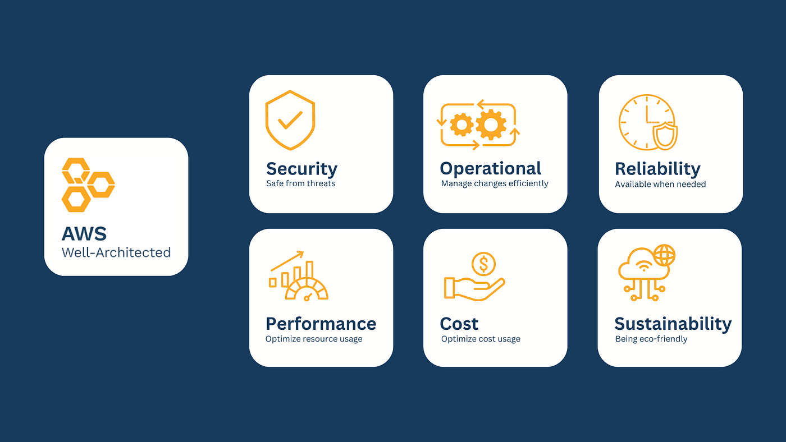

## Security and Compliance

- [Shared Responsibility Model](#shared-responsibility-model)
- [Well Architected Framework: 6 Pillars](#well-architected-framework-6-pillars)
- [Identity and Access Management (IAM)](#identity-and-access-management-iam)
- [IAM Best Practices](#iam-best-practices)
- [Web Application Firewall (WAF)](#web-application-firewall-waf)
- [Shield](#shield)
- [Macie](#macie)
- [Config](#config)
- [GuardDuty](#guardduty)
- [Inspector](#inspector)
- [Artifact](#artifact)
- [Cognito](#cognito)
- [Key Management Service (KMS)](#key-management-service-kms)
- [Cloud HSM](#cloud-hsm)
- [Secrets Manager](#secrets-manager)

### Shared Responsibility Model

- **AWS Responsibility:** Security of the cloud, including infrastructure and managed services.
- **Customer Responsibility:** Security in the cloud, including data management and application security.

### Well Architected Framework: 6 Pillars

1. **Operational Excellence:** Plan for failure and continuously improve operations.
2. **Security:** Automate security, encrypt data, and enforce least privilege.
3. **Reliability:** Design systems to recover quickly from failures.
4. **Performance Efficiency:** Use resources efficiently and experiment with new services.
5. **Cost Optimization:** Deliver resilient solutions at the lowest cost.
6. **Sustainability:** Minimize environmental impact and maximize utilization.

### Identity and Access Management (IAM)

- **Users:** Represent people or applications needing access.
- **Groups:** Collections of users with common access requirements.
- **Roles:** Temporary access permissions for users or services.
- **Policies:** JSON documents defining access permissions.

### IAM Best Practices

- Enable MFA for privileged users.
- Use strong password policies.
- Create individual users instead of using root.
- Use roles for EC2 instances.

### Security Groups 

- Act as an extra layer of security to determine who operate at the instance level.
- Allows you to specify allowable protocols
- Stateful (if traffic goes out it allows the traffic to redirect back)

### NACL (Network Access Control List)

- Tries to allow or deny traffic based on protocol and source IPs
- Operates at the subnet level

### Web Application Firewall (WAF)

- Protects web applications from common web attacks like SQL injection.

### Shield

- Managed DDoS protection service with standard and advanced options.

### Macie

- Uses machine learning to discover and protect sensitive data.

### Config

- Tracks and evaluates configurations of AWS resources.

### GuardDuty

- Intelligent threat detection system for unauthorized behavior.

### Inspector

- Assesses applications for vulnerabilities and security risks.

### Artifact

- Provides access to AWS compliance and security reports.

### Cognito

- User authentication and authorization for mobile and web applications.

### Key Management Service (KMS)

- Manages and stores encryption keys.

### Cloud HSM

- Hardware security module for managing your own encryption keys.

### Secrets Manager

- Store and manage secrets like database credentials securely.

### AWS Security and Compliance

| Service                                  | Description                                  | Use Case                                         | Key Features                                             |
| ---------------------------------------- | -------------------------------------------- | ------------------------------------------------ | -------------------------------------------------------- |
| **AWS Shield**                           | DDoS protection service                      | Protecting against DDoS attacks                  | Automatic attack mitigation, 24/7 support                |
| **AWS WAF**                              | Web Application Firewall                     | Protecting web applications                      | Customizable rules, integration with CloudFront          |
| **AWS KMS**                              | Key Management Service                       | Managing encryption keys                         | Centralized key management, automatic key rotation       |
| **AWS CloudTrail**                       | API call logging service                     | Monitoring API activity                          | Detailed logs, compliance auditing                       |
| **AWS Config**                           | Resource configuration monitoring            | Compliance tracking and auditing                 | Track configuration changes, automated compliance checks |
| **AWS Macie**                            | Data security and privacy service            | Discover and protect sensitive data              | Automated data classification and protection             |
| **AWS GuardDuty**                        | Threat detection service                     | Continuous security monitoring                   | Threat detection and alerting                            |
| **AWS Inspector**                        | Security assessment service                  | Assessing security vulnerabilities               | Automated security assessments                           |
| **AWS Artifact**                         | Compliance reports and documentation         | Access to compliance reports                     | Access to AWS compliance documentation                   |
| **AWS Cognito**                          | User authentication and access control       | Managing user identities and access              | User pools, identity pools, secure authentication        |
| **AWS Secrets Manager**                  | Manage secrets and sensitive data            | Securely storing and managing secrets            | Automatic rotation, secure access                        |
| **AWS CloudHSM**                         | Hardware security module service             | Managing encryption keys with dedicated hardware | FIPS 140-2 compliance, dedicated HSM devices             |
| **Identity and Access Management (IAM)** | Service for managing access to AWS resources | Managing users and permissions                   | Fine-grained access control, security policies           |
